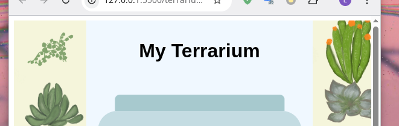

# Note

[JavaScript note](./jsnote.md)

## 如何设置一行元素中的某列为固定宽度

```css
.container {
  display: flex;
  width: 100vw;
}
.center {
  flex: 1;
}
.side {
  background-color: aliceblue;
  flex: 0 0 15%;
}
```

## 如果父元素设置了宽度，子元素太大超出了这个大小，怎么办

不显示超出的部分

```css
.container {
  overflow: hidden;
}
```

## 显示内容没有占满整个浏览器页面，最外围有一圈空白。设置了元素宽高为 100%，或 100vw，100vh 后，出现垂直或水平滚动条



清除浏览器默认添加的边距

默认的盒模型，在设置宽高时，设置的是内容的宽高，没有把内边距（padding）边框（border）计算在内。设置盒模型为怪异盒模型后，设置的宽高是内容，内边距，边框的总宽度。

```css
* {
  margin: 0;
  padding: 0;
  box-size: border-box;
}
```

## 有哪些样式能够被继承

字体相关的样式

```css
body {
  font-family: "Segoe UI", Tahoma, Geneva, Verdana, sans-serif;
  font-size: 2rem;
}
```

## 如何设置字体大小最合适

`1rem`表示 1 倍浏览器设置字体大小

```css
#title {
  font-size: 1rem;
}
```

## 如何设置元素宽度，高度更合适

使用`[1, 100]`的数字`x`，`x%`表示父元素大小的`x%`，`xvh`，`xvw`表示`x%`视口（viewport，浏览器内容窗口）的大小

```css
#page {
  width: 100vw;
  height: 100vh;
}
```

## 如何使一行文字垂直居中

```css
h1 {
  display: flex;
  align-items: center;
}
```

## 为什么使用 vim 进行输入时，经常在输入了中文后，想要退出插入模式进入普通模式时，输入一段不需要的奇怪字符，而没有退出插入模式？

可以稍微减慢打字的速度，让使用`<Shift>`进行中英文切换能顺利完成。不然会出现，还没有完成中文到英文的切换，就输入 vim 指令。

## 如何设置元素的背景色

```css
.container {
  background-color: aliceblue;
}
```

## 子元素的大小超出了父元素时，该如何恰当设置子元素的大小

具有高度或宽度的子元素的大小设置为 100%（100%父元素大小），一直往上到最顶层有设置大小的父元素为止，都要设置大小（width, height）属性。

在这里有宽高属性的最顶层元素是`#page {}`。往下每一层都需要设置宽高，直到目标子元素。

```css
#page {
  height: 100vh;
}
.container {
  height: 100%;
}
.plant-holder {
  height: 14%;
}
.plant {
  height: 100%;
}
```

## 如何让一个容器中的内容居中对齐

```css
.plant-holder {
  display: flex;
  justify-content: center;
  align-items: center;
}
```

## 如何让一行或列的元素完全等距排列

```css
.container {
  display: flex;
  justify-content: space-evenly;
}
```

## 一个本身就有宽度和高度的元素，要怎么设置它和包含它的容器的宽高

```css
.item {
  width: 100%;
  height: auto;
}

.item-container {
  width: 100%;
  height: 10%;
}

.outer-container {
  width: 15vw;
  height: 100vh;
  display: flex;
  flex-direction: column;
  justify-content: space-evenly;
}
```

## 如何让内部元素保持宽高比缩放到填满外部的元素，即总存在内部元素的宽度或高度与外部元素一样
